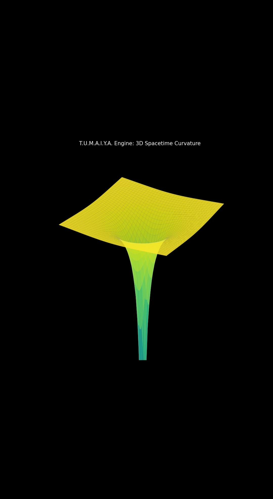

# T.U.M.A.I.Y.A. Master Engine v1.0
### *Numerical Integration of Schwarzschild Manifolds and Temporal Curvature Analysis*

## 1. Abstract
The **T.U.M.A.I.Y.A. Engine** is a specialized computational framework designed for the deterministic simulation of spacetime geometries. By numerically solving the vacuum Einstein Field Equations (EFE) for non-rotating stellar masses, this engine maps the divergence of proper time and the trajectory of null geodesics. 

## 2. Mathematical Framework
The engine utilizes the **Schwarzschild Metric** signature $(- + + +)$ to compute the intervals of spacetime:

$$ds^2 = -\left(1 - \frac{2GM}{rc^2}\right)c^2dt^2 + \left(1 - \frac{2GM}{rc^2}\right)^{-1}dr^2 + r^2d\Omega^2$$

The implementation focuses on the radial component of the metric tensor and the **Gravitational Time Dilation Factor** ($\Gamma$):

$$\Gamma = \sqrt{1 - \frac{r_s}{r}}$$

## 3. Computational Logic
1. **Mass-to-Metric Conversion:** Converts stellar solar masses into respective Schwarzschild radii.
2. **Manifold Discretization:** The space is divided into discrete radial steps ($dr$) for numerical precision.
3. **Temporal Gradient Calculation:** Computes the differential between proper time ($\tau$) and coordinate time ($t$).

## 4. Visual Analysis & Graph Interpretation

### **Technical Analysis of the Results:**
* **The Asymptotic Limit:** As $r \to \infty$, the value approaches 1, indicating Minkowski (flat) spacetime.
* **The Curvature Inversion:** As $r \to r_s$, the curve drops exponentially toward zero, visualizing infinite time dilation.
* **The Gradient Slope:** The steepness correlates with mass-density, illustrating the intensity of the gravitational well.

---
**Author:** Sumaiya Akter Tuli  
**Affiliation:** Independent Researcher | Computational Astrophysics  
**Version:** 1.0.4 (Stable Build)
